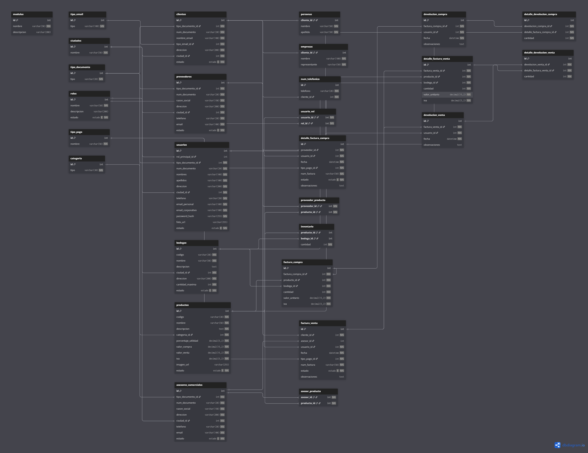

# 📦 TechDistrib ERP — Sistema de Gestión Comercial

> **Empresa ficticia:** TechDistrib S.A.S  
> **Sector:** Distribución mayorista de tecnología  
> **Ubicación:** Bucaramanga, Santander, Colombia  
> **Tamaño:** 45 empleados, 3 bodegas, 12 asesores comerciales

---

## 🏢 Caso de estudio

### El problema

**TechDistrib S.A.S** es una distribuidora mayorista de equipos tecnológicos
(laptops, tablets, celulares, accesorios y periféricos) que abastece a tiendas
minoristas, colegios y empresas en el nororiente colombiano.

Antes de este sistema, la empresa operaba con hojas de cálculo en Excel y
anotaciones manuales, lo que generaba los siguientes problemas críticos:

| Problema | Impacto real |
|---|---|
| Inventario desactualizado | Se vendían productos sin stock disponible |
| Facturas en Excel sin control | Errores en IVA y descuentos, pérdidas no detectadas |
| Sin trazabilidad de devoluciones | No se sabía si una devolución ya había sido procesada |
| Comisiones calculadas a mano | Conflictos con asesores por errores en el pago mensual |
| Sin control de bodegas | Mercancía mal ubicada, pérdidas por desbordamiento |
| Sin auditoría de usuarios | Imposible rastrear quién hizo qué en el sistema |
| Garantías en papel | Clientes sin soporte por garantías vencidas no detectadas |

### La solución

Se diseñó un ERP en **MySQL puro** (sin framework externo) que centraliza
todas las operaciones del negocio con reglas de negocio embebidas en la base
de datos. La decisión de implementarlo en la BD garantiza que **ninguna
aplicación cliente pueda saltarse las validaciones**, independientemente
del lenguaje o framework que consuma el sistema.

### Flujo operativo real

```
PROVEEDOR (Samsung, HP, Lenovo)
       │
       ▼
  [Factura Compra]  ──► Stock entra a Bodega Central (Bucaramanga)
       │
       ▼
  [Traslado]        ──► Bodega Norte (Cúcuta) / Bodega Sur (Bogotá)
       │
       ▼
  [Factura Venta]   ──► Cliente (tienda, empresa, colegio)
       │
       ├──► Trigger: descuenta stock en bodega
       ├──► Trigger: genera 2 garantías por producto
       ├──► Trigger: acumula comisión del asesor (2%)
       └──► Trigger: evalúa descuento acumulado del cliente
```

### Actores del sistema

| Actor | Descripción | Usuario BD |
|---|---|---|
| Administrador TI | Gestiona el sistema y usuarios | `admin_erp` |
| Gerente General | Revisa reportes y KPIs del negocio | `gerente_erp` |
| Cajero de ventas | Registra facturas en el punto de venta | `cajero_erp` |
| Jefe de bodega | Recibe mercancía y gestiona traslados | `bodeguero_erp` |
| Asesor comercial | Gestiona clientes y revisa sus comisiones | `asesor_erp` |
| Contador | Revisa facturas, IVA y rentabilidad | `contador_erp` |
| API REST (Node.js) | Backend que consume todos los SPs | `app_backend` |

### Reglas del negocio de TechDistrib

- Los equipos con precio de venta **mayor a $1.423.500** (1 SMLV 2026) generan **IVA del 19%**; accesorios y cables por debajo de ese valor no cobran IVA.
- Los clientes que acumulen compras **superiores a $200.000.000** reciben automáticamente un **5% de descuento** en todas sus facturas futuras.
- Clientes con más de **$500.000.000** acumulados reciben **10% de descuento**.
- Cada producto vendido genera **2 garantías**: empresa (3 meses) y proveedor (12 meses).
- Los asesores reciben **comisión del 2%** sobre el total de cada factura emitida a su nombre.
- No se pueden realizar ventas si el stock en la bodega seleccionada es insuficiente.
- Las facturas y documentos contables son **inmutables**: no se modifican, solo se anulan con trazabilidad.
- Los registros con historial transaccional **nunca se eliminan físicamente** de la BD.

---

## 📁 Estructura del proyecto

```
proyecto2/
├── 01_ddl.sql               # Creación de tablas
├── 02_inserts.sql           # Datos maestros iniciales
├── 03_stored_procedures.sql # CRUDs y operaciones
├── 04_vistas.sql            # Vistas de consulta
├── 05_triggers.sql          # Automatizaciones y validaciones
├── 06_funciones.sql         # Funciones reutilizables
├── 07_reportes.sql          # SPs de reportes gerenciales
├── 08_pruebas.sql           # Script de pruebas completo
├── 09_usuarios.sql          # Creación de usuarios y permisos
└── README.md
```

---

## 🗄️ Base de datos

- **Motor:** MySQL 8.0+
- **Nombre:** `proyecto2`
- **Charset:** `utf8mb4`
- **Collation:** `utf8mb4_unicode_ci`

---

## 🚀 Instalación y ejecución completa

### Opción A — Desde MySQL Workbench

1. Abre MySQL Workbench y conéctate a tu servidor.
2. Abre cada archivo en orden desde **File → Open SQL Script**.
3. Ejecuta cada uno con `Ctrl + Shift + Enter`.

```
01_ddl.sql
02_inserts.sql
03_stored_procedures.sql
04_vistas.sql
05_triggers.sql
06_funciones.sql
07_reportes.sql
08_pruebas.sql     ← opcional, solo para verificar
09_usuarios.sql    ← crear usuarios del sistema
```

### Opción B — Desde terminal (MySQL CLI)

```bash
mysql -u root -p < 01_ddl.sql
mysql -u root -p < 02_inserts.sql
mysql -u root -p < 03_stored_procedures.sql
mysql -u root -p < 04_vistas.sql
mysql -u root -p < 05_triggers.sql
mysql -u root -p < 06_funciones.sql
mysql -u root -p < 07_reportes.sql
mysql -u root -p < 08_pruebas.sql
mysql -u root -p < 09_usuarios.sql
```

### Opción C — Desde consola MySQL con SOURCE

```sql
SOURCE /ruta/proyecto2/01_ddl.sql;
SOURCE /ruta/proyecto2/02_inserts.sql;
SOURCE /ruta/proyecto2/03_stored_procedures.sql;
SOURCE /ruta/proyecto2/04_vistas.sql;
SOURCE /ruta/proyecto2/05_triggers.sql;
SOURCE /ruta/proyecto2/06_funciones.sql;
SOURCE /ruta/proyecto2/07_reportes.sql;
SOURCE /ruta/proyecto2/08_pruebas.sql;
SOURCE /ruta/proyecto2/09_usuarios.sql;
```

> ⚠️ **El orden es obligatorio.** Las funciones deben existir antes que los
> reportes. Los usuarios deben crearse al final cuando todos los objetos ya existen.

---

## 👥 Usuarios del sistema (`09_usuarios.sql`)

El sistema implementa **7 roles de base de datos** siguiendo el principio de
**mínimo privilegio**: cada usuario solo accede a lo estrictamente necesario
para su función dentro del negocio.

### Roles y usuarios creados

| Usuario | Rol del negocio | Acceso desde |
|---|---|---|
| `admin_erp` | Administrador del sistema | `localhost` |
| `gerente_erp` | Gerente / Directivo | `localhost` |
| `cajero_erp` | Cajero / Vendedor en mostrador | `localhost` |
| `bodeguero_erp` | Encargado de bodega | `localhost` |
| `asesor_erp` | Asesor comercial externo | `localhost` |
| `contador_erp` | Contador / Auditor | `localhost` |
| `app_backend` | Aplicación web / API REST | `%` (cualquier IP) |

> En producción reemplaza `%` de `app_backend` por la IP exacta del servidor
> backend y agrega `REQUIRE SSL` al `CREATE USER`.

### Permisos por rol

| Usuario | Tablas | Vistas | SPs CRUD | SPs Reporte | Funciones |
|---|---|---|---|---|---|
| `admin_erp` | ALL | ALL | ALL | ALL | ALL |
| `gerente_erp` | SELECT all | SELECT all | ❌ | ✅ todos | ✅ consulta |
| `cajero_erp` | SELECT catálogos | SELECT ventas | ✅ ventas + clientes | ❌ | ✅ precios |
| `bodeguero_erp` | SELECT inventario | SELECT bodega | ✅ compras + traslados | ✅ inventario | ✅ stock |
| `asesor_erp` | SELECT sus ventas | SELECT asesor | ❌ | ✅ sus reportes | ✅ comisión |
| `contador_erp` | SELECT contable | SELECT financiero | ❌ | ✅ financieros | ✅ totales |
| `app_backend` | ❌ directo | ❌ directo | ✅ todos | ✅ todos | ✅ todas |

### Detalle de permisos por rol

#### 🔴 `admin_erp` — Administrador
- `ALL PRIVILEGES ON proyecto2.*`
- `WITH GRANT OPTION`: puede asignar permisos a otros usuarios
- Único rol con acceso total incluyendo DDL

#### 🟠 `gerente_erp` — Gerente
- `SELECT` en todas las tablas transaccionales y vistas
- `EXECUTE` en los 8 SPs de reportes gerenciales
- `EXECUTE` en funciones de consulta financiera y de inventario
- **No puede** insertar, modificar ni ejecutar CRUDs

#### 🟡 `cajero_erp` — Cajero / Vendedor
- `SELECT` en catálogos (productos, clientes, bodegas, tipos)
- `SELECT` en vistas de ventas e historial de cliente
- `EXECUTE` en SPs de factura venta, devolución venta y gestión de clientes
- `EXECUTE` en funciones de precios, descuentos y stock
- **No puede** ver compras, usuarios ni ejecutar reportes gerenciales

#### 🟢 `bodeguero_erp` — Bodeguero
- `SELECT` en inventario, bodegas, compras y proveedores
- `SELECT` en vistas de stock y facturas de compra
- `EXECUTE` en SPs de factura compra, devolución compra y traslado
- `EXECUTE` en funciones de stock y capacidad de bodega
- **No puede** ver ventas, clientes ni información de comisiones

#### 🔵 `asesor_erp` — Asesor Comercial
- `SELECT` en sus propias ventas y comisiones
- `SELECT` en vistas de asesor e historial de cliente
- `EXECUTE` en SPs de reportes de ventas, comisiones y clientes
- `EXECUTE` en funciones de comisión, descuento y precio
- **No puede** crear facturas ni modificar datos

#### 🟣 `contador_erp` — Contador
- `SELECT` en todas las tablas contables y financieras
- `SELECT` en vistas de facturas, devoluciones e historial
- `EXECUTE` en SPs de reportes financieros
- `EXECUTE` en funciones de totales, IVA, descuento y utilidad
- **No puede** crear, modificar ni eliminar ningún registro

#### ⚫ `app_backend` — Aplicación Backend
- **Sin acceso directo a tablas ni vistas**
- `EXECUTE` en todos los SPs de CRUD y reportes
- `EXECUTE` en todas las funciones del sistema
- Se conecta desde cualquier IP (`%`) — ideal para API REST

### Verificar permisos

```sql
SELECT user, host FROM mysql.user
WHERE user IN (
    'admin_erp','gerente_erp','cajero_erp',
    'bodeguero_erp','asesor_erp','contador_erp','app_backend'
);

SHOW GRANTS FOR 'cajero_erp'@'localhost';
SHOW GRANTS FOR 'app_backend'@'%';

-- Cambiar contraseña
-- ALTER USER 'cajero_erp'@'localhost' IDENTIFIED BY 'NuevaClave#2026';
```

---

## ⚙️ Cómo ejecutar los Stored Procedures

### Productos

```sql
CALL sp_crear_producto('PROD-001', 'Laptop HP 15', 'Laptop 8GB',
                        1, 30.00, 2500000.00, NULL, @id);
SELECT @id;
CALL sp_actualizar_producto(1, 'Laptop HP 15 Pro', 'Desc',
                             1, 35.00, 2600000.00, NULL, 1);
CALL sp_desactivar_producto(1, 1);
CALL sp_listar_productos('1', NULL);
```

### Clientes

```sql
CALL sp_crear_cliente_persona(1,'1098765432','juan.perez',1,
                               'Calle 10',1,'M','Juan','Pérez',
                               '3001234567', @id);
CALL sp_crear_cliente_empresa(2,'900123456-1','contacto',2,
                               'Av. 10',1,'Empresa SAS','Rep',
                               '6017654321', @id);
CALL sp_actualizar_cliente(1,'juan.nuevo',1,'Dirección',1,'M',1);
CALL sp_desactivar_cliente(1, 1);
CALL sp_leer_cliente(1);
```

### Usuarios

```sql
CALL sp_crear_usuario(1,1,'1234567890','María','López',
                       'Carrera 5',1,'3109876543',
                       'maria@gmail.com','maria@empresa.com',
                       '$2b$12$hash...', @id);
CALL sp_actualizar_usuario(1,'María','López','Dir',1,'310...',NULL,1);
CALL sp_desactivar_usuario(2, 1);
```

### Factura de Venta

```sql
CALL sp_crear_factura_venta(1,1,1,1,'FV-001','Obs', @id);
CALL sp_agregar_linea_venta(@id, 1, 1, 3, 1);
CALL sp_anular_factura_venta(1, 1);
```

### Factura de Compra

```sql
CALL sp_crear_factura_compra(1,1,2,'FC-001','Compra Q1', @id);
CALL sp_agregar_linea_compra(@id, 1, 1, 50, 2500000.00);
CALL sp_anular_factura_compra(1, 1);
```

### Devoluciones

```sql
CALL sp_crear_devolucion_venta(1,1,'Producto dañado',1,2, @id);
CALL sp_crear_devolucion_compra(1,1,'Mercancía mal estado',1,5, @id);
```

---

## 👁️ Cómo consultar las Vistas

```sql
SELECT * FROM v_stock_actual;
SELECT * FROM v_stock_bajo;
SELECT * FROM v_stock_total_producto WHERE stock_total < 10;
SELECT * FROM v_facturas_venta WHERE estado = '1';
SELECT * FROM v_detalle_facturas_venta WHERE num_factura = 'FV-001';
SELECT * FROM v_ventas_por_asesor WHERE anio = 2026 AND mes = 3;
SELECT * FROM v_historial_cliente WHERE cliente_id = 1;
SELECT * FROM v_permisos_usuario WHERE usuario_id = 1;
SELECT * FROM v_logs_errores LIMIT 50;
SELECT * FROM v_actividad_reciente;
```

---

## 🔧 Cómo usar las Funciones

```sql
-- Factura
SELECT fn_subtotal_factura_venta(1), fn_iva_factura_venta(1),
       fn_valor_descuento_factura(1), fn_total_factura_venta(1);
SELECT fn_total_factura_compra(1);

-- Descuentos
SELECT fn_descuento_cliente(1);
SELECT fn_aplicar_descuento(5000000.00, 1);

-- Inventario
SELECT fn_stock_disponible(1, 1);
SELECT fn_stock_total_producto(1);
SELECT fn_valor_inventario_costo(1);
SELECT fn_capacidad_disponible_bodega(1);

-- Asesores
SELECT fn_comision_asesor(1, '2026-03-01');
SELECT fn_total_ventas_asesor(1, '2026-03-01');

-- Productos
SELECT fn_precio_neto_producto(1);
SELECT fn_utilidad_producto(1,'2026-01-01','2026-03-31');

-- Garantías
SELECT fn_garantia_vigente(1);
SELECT fn_dias_garantia_restantes(1);
```

---

## 📊 Cómo ejecutar los Reportes

```sql
CALL sp_reporte_ventas_periodo('2026-01-01','2026-03-31',NULL,NULL);
CALL sp_reporte_inventario_bodega(NULL, NULL);
CALL sp_reporte_comisiones_mes('2026-03-01');
CALL sp_reporte_rotacion_productos('2026-03-01', 5);
CALL sp_reporte_compras_periodo('2026-01-01','2026-03-31',NULL);
CALL sp_reporte_devoluciones_periodo('2026-01-01','2026-03-31','TODAS');
CALL sp_reporte_rentabilidad_categoria('2026-01-01','2026-03-31');
CALL sp_reporte_top_clientes('2026-01-01','2026-03-31',NULL);
```

---

## 🧪 Scripts de prueba (`08_pruebas.sql`)

El archivo cubre **53 casos de prueba** organizados en 9 bloques.
Cada prueba indica el resultado esperado como comentario.

| Bloque | Qué prueba | Pruebas |
|---|---|---|
| 1 | Productos: crear, actualizar, desactivar, borrado bloqueado | 01 – 05 |
| 2 | Clientes: persona, empresa, leer, actualizar, desactivar | 06 – 10 |
| 3 | Usuarios: crear, actualizar, desactivar | 11 – 13 |
| 4 | Factura compra + límite de capacidad de bodega | 14 – 16 |
| 5 | Factura venta, stock, garantías, comisión, anulación | 17 – 23 |
| 6 | Devoluciones venta y compra + bloqueos por exceso | 24 – 27 |
| 7 | Funciones: desglose factura, descuentos, stock, garantías | 28 – 35 |
| 8 | Vistas: stock, facturas, asesores, logs, actividad | 36 – 45 |
| 9 | Reportes gerenciales completos | 46 – 53 |

```sql
SOURCE /ruta/proyecto2/08_pruebas.sql;
```

---

## 🧱 Modelo de datos y normalización

El diseño está en **3FN (Tercera Forma Normal)**.

### `clientes` + `personas` + `empresas`
TechDistrib vende tanto a personas naturales (freelancers, docentes) como a
empresas (colegios, pymes). Ambos comparten documento, email y dirección, pero
tienen atributos exclusivos. Unirlos en una tabla generaría columnas `NULL`
masivas y violaría la 1FN semánticamente.

### `clientes` + `num_telefonico`
Un cliente empresa puede tener línea fija, celular del representante y celular
de compras. La tabla `num_telefonico` con FK a `clientes` permite N teléfonos
sin columnas redundantes.

### `clientes` + `tipo_documento` + `tipo_email`
Los tipos de documento (CC, NIT, CE) y dominios de correo son catálogos
que se repiten en cientos de clientes. Normalizarlos garantiza consistencia
y evita repetir cadenas en cada fila.

### `productos` + `categoria`
TechDistrib maneja categorías como Laptops, Celulares, Tablets, Accesorios y
Periféricos. Repetir el nombre de categoría en cada producto viola la 2FN;
un cambio de nombre se propagaría automáticamente desde la tabla padre.

### `factura_venta` + `detalle_factura_venta`
Una venta de TechDistrib puede incluir 1 laptop + 2 mouses + 1 teclado.
Cada ítem tiene su propio IVA, descuento y precio. Mezclar cabecera y líneas
viola la 1FN e impide calcular correctamente por producto.

### `factura_compra` + `detalle_factura_compra`
Una orden a Samsung puede traer 30 celulares + 10 tablets con precios distintos.
La separación permite actualizar el inventario línea por línea y calcular el
total real pagado al proveedor.

### `devolucion_*` + `detalle_devolucion_*`
Un cliente puede devolver solo 1 de los 3 productos de una factura. El detalle
valida que no se devuelva más de lo comprado/vendido por línea específica.

### `inventario` (producto + bodega)
TechDistrib tiene 3 bodegas. Un mismo modelo de laptop puede estar en
Bucaramanga (50 und), Cúcuta (20 und) y Bogotá (30 und). La clave compuesta
`(producto_id, bodega_id)` evita duplicar datos del producto por cada bodega.

### `bodegas` + `ciudades`
Las 3 bodegas están en ciudades distintas. Normalizar `ciudad` evita repetir
el nombre y permite filtrar inventario por ubicación geográfica en los reportes.

### `usuarios` + `roles` + `permisos` + `modulos`
RBAC completo: un cajero no debe ver reportes de rentabilidad; un contador
no debe crear facturas. Administrar esto en BD garantiza que ningún cliente
(web, móvil, API) pueda saltarse las restricciones.

### `garantias`
TechDistrib ofrece garantía propia de 3 meses y gestiona la del proveedor
(Samsung, HP, Lenovo) de 12 meses. Separarlas con `tipo ENUM` permite
verificar cuál aplica en cada reclamación del cliente.

### `logs`
Tabla centralizada de auditoría con `dato_anterior` y `dato_nuevo` en JSON.
Si un cajero anula una factura, el gerente puede ver exactamente qué cambió
y quién lo hizo, sin necesitar tablas de log por cada entidad.

### `comisiones_asesor`
Los 12 asesores se pagan el primer día hábil del mes siguiente. La tabla
materializa el acumulado mensual; el trigger actualiza automáticamente
con cada factura para evitar recalcular todo al momento del pago.

### `reporte_rotacion_producto`
Cruzar ventas + compras + stock del periodo para 500 productos sería
inviable en tiempo real. Los triggers actualizan esta tabla automáticamente
con cada movimiento de inventario.

### `descuentos_cliente`
Los descuentos del 5% y 10% se activan automáticamente por triggers,
pero el gerente puede asignar descuentos manuales a clientes estratégicos.
La tabla soporta múltiples reglas simultáneas por cliente con fecha de vigencia.

---

## ⚙️ CRUDs — Decisiones de diseño

| Módulo | Crear | Leer | Actualizar | Eliminar | Razón |
|---|---|---|---|---|---|
| Productos | ✅ | ✅ | ✅ | ❌ solo desactivar | Historial de ventas |
| Clientes | ✅ x2 | ✅ | ✅ | ❌ solo desactivar | Historial de ventas |
| Usuarios | ✅ | ❌ directo | ✅ | ❌ solo desactivar | Auditoría |
| Factura venta | ✅ | ❌ directo | ❌ | ❌ solo anular | Documento contable |
| Factura compra | ✅ | ❌ directo | ❌ | ❌ solo anular | Documento contable |
| Devolución venta | ✅ | ❌ directo | ❌ | ❌ | Documento contable |
| Devolución compra | ✅ | ❌ directo | ❌ | ❌ | Documento contable |
| Traslado inventario | ✅ | ❌ directo | ❌ | ❌ | Operación especial |

> **¿Por qué no hay DELETE?** Los registros con historial transaccional no se
> eliminan físicamente porque romperían la integridad referencial y la
> trazabilidad contable. Se usa `estado = '0'` para desactivar.

---

## 👁️ Vistas

| Vista | Para qué se usa |
|---|---|
| `v_stock_actual` | Ver stock por producto y bodega con valores |
| `v_stock_bajo` | Alerta de productos con menos de 5 unidades |
| `v_stock_total_producto` | Stock consolidado de todas las bodegas |
| `v_facturas_venta` | Listado de ventas con totales calculados |
| `v_detalle_facturas_venta` | Línea a línea de cada factura de venta |
| `v_ventas_por_asesor` | Comisiones y rendimiento por asesor/mes |
| `v_devoluciones_venta` | Historial de devoluciones de clientes |
| `v_facturas_compra` | Listado de compras con totales calculados |
| `v_devoluciones_compra` | Historial de devoluciones a proveedores |
| `v_historial_cliente` | Total comprado y si aplica descuento |
| `v_permisos_usuario` | Permisos efectivos por usuario (rol + directos) |
| `v_logs_errores` | Auditoría de errores del sistema |
| `v_actividad_reciente` | Últimas 24 horas de actividad |

---

## ⚡ Triggers

| Trigger | Tipo | Propósito |
|---|---|---|
| `trg_validar_capacidad_bodega` | BEFORE INSERT | Bloquea compra si bodega llega a su límite |
| `trg_validar_stock_venta` | BEFORE INSERT | Bloquea venta si no hay stock |
| `trg_validar_stock_devolucion_compra` | BEFORE INSERT | Bloquea dev. compra sin stock |
| `trg_validar_cantidad_devolucion_venta` | BEFORE INSERT | Bloquea dev. venta si supera lo vendido |
| `trg_validar_cantidad_devolucion_compra` | BEFORE INSERT | Bloquea dev. compra si supera lo comprado |
| `trg_recalcular_precio_producto` | BEFORE UPDATE | Recalcula precio e IVA automáticamente |
| `trg_proteger_borrado_producto` | BEFORE DELETE | Bloquea borrado con historial |
| `trg_crear_garantias` | AFTER INSERT | Crea 2 garantías por línea vendida |
| `trg_evaluar_descuento_cliente` | AFTER INSERT | Activa descuento al superar $200M |
| `trg_calcular_comision_asesor` | AFTER INSERT | Acumula comisión por periodo |
| `trg_proteger_borrado_usuario` | BEFORE DELETE | Bloquea borrado con facturas |
| `trg_actualizar_rotacion_venta` | AFTER INSERT | Actualiza reporte de rotación |
| `trg_actualizar_rotacion_compra` | AFTER INSERT | Actualiza reporte de rotación |

> **Decisión de diseño:** El movimiento de inventario se gestiona
> **exclusivamente desde los SPs** para evitar doble ejecución.
> Los triggers solo validan, protegen y automatizan.

---

## 🔧 Funciones

| Función | Retorna | Uso típico |
|---|---|---|
| `fn_subtotal_factura_venta(id)` | DECIMAL | Base antes de IVA y descuento |
| `fn_iva_factura_venta(id)` | DECIMAL | Total IVA de la factura |
| `fn_valor_descuento_factura(id)` | DECIMAL | Cuánto se descontó en pesos |
| `fn_total_factura_venta(id)` | DECIMAL | Total final a cobrar |
| `fn_total_factura_compra(id)` | DECIMAL | Total a pagar al proveedor |
| `fn_descuento_cliente(cliente_id)` | DECIMAL | % de descuento vigente |
| `fn_aplicar_descuento(monto, cliente_id)` | DECIMAL | Monto después del descuento |
| `fn_stock_disponible(prod, bodega)` | INT | Stock en bodega específica |
| `fn_stock_total_producto(prod_id)` | INT | Stock en todas las bodegas |
| `fn_valor_inventario_costo(prod_id)` | DECIMAL | Valor del inventario a costo |
| `fn_capacidad_disponible_bodega(bod_id)` | INT | Cuánto cabe aún en bodega |
| `fn_comision_asesor(asesor, periodo)` | DECIMAL | Comisión del mes |
| `fn_total_ventas_asesor(asesor, periodo)` | DECIMAL | Ventas brutas del mes |
| `fn_utilidad_producto(prod, ini, fin)` | DECIMAL | Ganancia por producto |
| `fn_precio_neto_producto(prod_id)` | DECIMAL | Precio con IVA incluido |
| `fn_garantia_vigente(garantia_id)` | 0 / 1 | Si la garantía está activa |
| `fn_dias_garantia_restantes(garantia_id)` | INT | Días que quedan o vencidos |

---

## 📊 Reportes gerenciales

| # | Procedimiento | Filtra por | Qué retorna |
|---|---|---|---|
| 1 | `sp_reporte_ventas_periodo` | Fecha ini/fin, ciudad, asesor | Facturas con subtotal, IVA, descuento y total final |
| 2 | `sp_reporte_inventario_bodega` | Bodega, categoría | Stock con alerta: NORMAL / BAJO / CRÍTICO / SIN STOCK |
| 3 | `sp_reporte_comisiones_mes` | Periodo (mes) | Asesores con total vendido, % y valor comisión |
| 4 | `sp_reporte_rotacion_productos` | Periodo, top N | Clasificación ALTA / MEDIA / BAJA / SIN MOVIMIENTO |
| 5 | `sp_reporte_compras_periodo` | Fecha ini/fin, proveedor | Facturas de compra con unidades y total |
| 6 | `sp_reporte_devoluciones_periodo` | Fecha ini/fin, tipo | Devoluciones con cantidad y valor devuelto |
| 7 | `sp_reporte_rentabilidad_categoria` | Fecha ini/fin | Costo, ingreso bruto, utilidad y margen % |
| 8 | `sp_reporte_top_clientes` | Fecha ini/fin, top N | Clientes por total pagado con descuento vigente |

---

## 🔐 Reglas de negocio implementadas

| Regla | Dónde se implementa |
|---|---|
| IVA 19% solo si precio > 1 SMLV ($1.423.500) | `sp_crear_producto` + `trg_recalcular_precio_producto` |
| Descuento 5% al superar $200M acumulados | `trg_evaluar_descuento_cliente` |
| Descuento 10% al superar $500M acumulados | `fn_descuento_cliente` |
| Garantía empresa 3m + proveedor 12m por venta | `trg_crear_garantias` |
| Comisión 2% al asesor por factura emitida | `trg_calcular_comision_asesor` |
| No se puede vender sin stock | `trg_validar_stock_venta` |
| No se puede superar capacidad de bodega | `trg_validar_capacidad_bodega` |
| No se puede devolver más de lo vendido/comprado | `trg_validar_cantidad_devolucion_*` |
| No se eliminan registros con historial | `trg_proteger_borrado_*` |
| Documentos contables no se modifican | Diseño de SPs sin UPDATE |

---
Aquí está el README completo con la sección de eventos añadida al final, lista para copiar y pegar:

text
# 📦 TechDistrib ERP — Sistema de Gestión Comercial

> **Empresa ficticia:** TechDistrib S.A.S  
> **Sector:** Distribución mayorista de tecnología  
> **Ubicación:** Bucaramanga, Santander, Colombia  
> **Tamaño:** 45 empleados, 3 bodegas, 12 asesores comerciales

---

## 🧮 Modelo Entidad–Relación (ERD)

> En esta sección se presenta el diagrama entidad–relación del sistema TechDistrib ERP, que resume las entidades principales, sus atributos clave y relaciones.

<!-- ERD IMAGE HERE -->


---

## 🏢 Caso de estudio

### El problema

**TechDistrib S.A.S** es una distribuidora mayorista de equipos tecnológicos
(laptops, tablets, celulares, accesorios y periféricos) que abastece a tiendas
minoristas, colegios y empresas en el nororiente colombiano.

Antes de este sistema, la empresa operaba con hojas de cálculo en Excel y
anotaciones manuales, lo que generaba los siguientes problemas críticos:

| Problema | Impacto real |
|---|---|
| Inventario desactualizado | Se vendían productos sin stock disponible |
| Facturas en Excel sin control | Errores en IVA y descuentos, pérdidas no detectadas |
| Sin trazabilidad de devoluciones | No se sabía si una devolución ya había sido procesada |
| Comisiones calculadas a mano | Conflictos con asesores por errores en el pago mensual |
| Sin control de bodegas | Mercancía mal ubicada, pérdidas por desbordamiento |
| Sin auditoría de usuarios | Imposible rastrear quién hizo qué en el sistema |
| Garantías en papel | Clientes sin soporte por garantías vencidas no detectadas |

### La solución

Se diseñó un ERP en **MySQL puro** (sin framework externo) que centraliza
todas las operaciones del negocio con reglas de negocio embebidas en la base
de datos. La decisión de implementarlo en la BD garantiza que **ninguna
aplicación cliente pueda saltarse las validaciones**, independientemente
del lenguaje o framework que consuma el sistema.

### Flujo operativo real

```
PROVEEDOR (Samsung, HP, Lenovo)
       │
       ▼
  [Factura Compra]  ──► Stock entra a Bodega Central (Bucaramanga)
       │
       ▼
  [Traslado]        ──► Bodega Norte (Cúcuta) / Bodega Sur (Bogotá)
       │
       ▼
  [Factura Venta]   ──► Cliente (tienda, empresa, colegio)
       │
       ├──► Trigger: descuenta stock en bodega
       ├──► Trigger: genera 2 garantías por producto
       ├──► Trigger: acumula comisión del asesor (2%)
       └──► Trigger: evalúa descuento acumulado del cliente
```

### Actores del sistema

| Actor | Descripción | Usuario BD |
|---|---|---|
| Administrador TI | Gestiona el sistema y usuarios | `admin_erp` |
| Gerente General | Revisa reportes y KPIs del negocio | `gerente_erp` |
| Cajero de ventas | Registra facturas en el punto de venta | `cajero_erp` |
| Jefe de bodega | Recibe mercancía y gestiona traslados | `bodeguero_erp` |
| Asesor comercial | Gestiona clientes y revisa sus comisiones | `asesor_erp` |
| Contador | Revisa facturas, IVA y rentabilidad | `contador_erp` |
| API REST (Node.js) | Backend que consume todos los SPs | `app_backend` |

### Reglas del negocio de TechDistrib

- Los equipos con precio de venta **mayor a $1.423.500** (1 SMLV 2026) generan **IVA del 19%**; accesorios y cables por debajo de ese valor no cobran IVA.
- Los clientes que acumulen compras **superiores a $200.000.000** reciben automáticamente un **5% de descuento** en todas sus facturas futuras.
- Clientes con más de **$500.000.000** acumulados reciben **10% de descuento**.
- Cada producto vendido genera **2 garantías**: empresa (3 meses) y proveedor (12 meses).
- Los asesores reciben **comisión del 2%** sobre el total de cada factura emitida a su nombre.
- No se pueden realizar ventas si el stock en la bodega seleccionada es insuficiente.
- Las facturas y documentos contables son **inmutables**: no se modifican, solo se anulan con trazabilidad.
- Los registros con historial transaccional **nunca se eliminan físicamente** de la BD.

---

## 📁 Estructura del proyecto

```
proyecto2/
├── DDL.sql                  # Creación de tablas
├── DML.sql                  # Datos maestros iniciales
├── procedures.sql           # CRUDs y operaciones
├── views.sql                # Vistas de consulta
├── triggers.sql             # Automatizaciones y validaciones
├── funciones.sql            # Funciones reutilizables
├── reportes_proc.sql        # SPs de reportes gerenciales
├── usuarios.sql             # Creación de usuarios y permisos
├── eventos.sql              # Eventos programados mensuales
└── README.md
```

---

## 🗄️ Base de datos

- **Motor:** MySQL 8.0+
- **Nombre:** `mini_erp`
- **Charset:** `utf8mb4`
- **Collation:** `utf8mb4_unicode_ci`

---

## 🚀 Instalación y ejecución completa

### Opción A — Desde MySQL Workbench

1. Abre MySQL Workbench y conéctate a tu servidor.
2. Abre cada archivo en orden desde **File → Open SQL Script**.
3. Ejecuta cada uno con `Ctrl + Shift + Enter`.

```
DDL.sql
DML.sql
procedures.sql
views.sql
triggers.sql
funciones.sql
reportes_proc.sql
usuarios.sql
eventos.sql        ← eventos programados mensuales
```

### Opción B — Desde terminal (MySQL CLI)

```bash
mysql -u root -p < DDL.sql
mysql -u root -p < DML.sql
mysql -u root -p < procedures.sql
mysql -u root -p < views.sql
mysql -u root -p < triggers.sql
mysql -u root -p < funciones.sql
mysql -u root -p < reportes_proc.sql
mysql -u root -p < usuarios.sql
mysql -u root -p < eventos.sql
```

### Opción C — Desde consola MySQL con SOURCE

```sql
SOURCE /ruta/proyecto/DDL.sql;
SOURCE /ruta/proyecto/DML.sql;
SOURCE /ruta/proyecto/procedures.sql;
SOURCE /ruta/proyecto/views.sql;
SOURCE /ruta/proyecto/triggers.sql;
SOURCE /ruta/proyecto/funciones.sql;
SOURCE /ruta/proyecto/reportes_proc.sql;
SOURCE /ruta/proyecto/usuarios.sql;
SOURCE /ruta/proyecto/eventos.sql;
```

> ⚠️ **El orden es obligatorio.** Las funciones deben existir antes que los
> reportes. Los usuarios y eventos deben ejecutarse al final cuando todos
> los objetos ya existen.

---

## 👥 Usuarios del sistema (`usuarios.sql`)

El sistema implementa **7 roles de base de datos** siguiendo el principio de
**mínimo privilegio**: cada usuario solo accede a lo estrictamente necesario
para su función dentro del negocio.

### Roles y usuarios creados

| Usuario | Rol del negocio | Acceso desde |
|---|---|---|
| `admin_erp` | Administrador del sistema | `localhost` |
| `gerente_erp` | Gerente / Directivo | `localhost` |
| `cajero_erp` | Cajero / Vendedor en mostrador | `localhost` |
| `bodeguero_erp` | Encargado de bodega | `localhost` |
| `asesor_erp` | Asesor comercial externo | `localhost` |
| `contador_erp` | Contador / Auditor | `localhost` |
| `app_backend` | Aplicación web / API REST | `%` (cualquier IP) |

> En producción reemplaza `%` de `app_backend` por la IP exacta del servidor
> backend y agrega `REQUIRE SSL` al `CREATE USER`.

### Permisos por rol

| Usuario | Tablas | Vistas | SPs CRUD | SPs Reporte | Funciones |
|---|---|---|---|---|---|
| `admin_erp` | ALL | ALL | ALL | ALL | ALL |
| `gerente_erp` | SELECT all | SELECT all | ❌ | ✅ todos | ✅ consulta |
| `cajero_erp` | SELECT catálogos | SELECT ventas | ✅ ventas + clientes | ❌ | ✅ precios |
| `bodeguero_erp` | SELECT inventario | SELECT bodega | ✅ compras + traslados | ✅ inventario | ✅ stock |
| `asesor_erp` | SELECT sus ventas | SELECT asesor | ❌ | ✅ sus reportes | ✅ comisión |
| `contador_erp` | SELECT contable | SELECT financiero | ❌ | ✅ financieros | ✅ totales |
| `app_backend` | ❌ directo | ❌ directo | ✅ todos | ✅ todos | ✅ todas |

### Detalle de permisos por rol

#### 🔴 `admin_erp` — Administrador
- `ALL PRIVILEGES ON mini_erp.*`
- `WITH GRANT OPTION`: puede asignar permisos a otros usuarios
- Único rol con acceso total incluyendo DDL

#### 🟠 `gerente_erp` — Gerente
- `SELECT` en todas las tablas transaccionales y vistas
- `EXECUTE` en los 8 SPs de reportes gerenciales
- `EXECUTE` en funciones de consulta financiera y de inventario
- **No puede** insertar, modificar ni ejecutar CRUDs

#### 🟡 `cajero_erp` — Cajero / Vendedor
- `SELECT` en catálogos (productos, clientes, bodegas, tipos)
- `SELECT` en vistas de ventas e historial de cliente
- `EXECUTE` en SPs de factura venta, devolución venta y gestión de clientes
- `EXECUTE` en funciones de precios, descuentos y stock
- **No puede** ver compras, usuarios ni ejecutar reportes gerenciales

#### 🟢 `bodeguero_erp` — Bodeguero
- `SELECT` en inventario, bodegas, compras y proveedores
- `SELECT` en vistas de stock y facturas de compra
- `EXECUTE` en SPs de factura compra, devolución compra y traslado
- `EXECUTE` en funciones de stock y capacidad de bodega
- **No puede** ver ventas, clientes ni información de comisiones

#### 🔵 `asesor_erp` — Asesor Comercial
- `SELECT` en sus propias ventas y comisiones
- `SELECT` en vistas de asesor e historial de cliente
- `EXECUTE` en SPs de reportes de ventas, comisiones y clientes
- `EXECUTE` en funciones de comisión, descuento y precio
- **No puede** crear facturas ni modificar datos

#### 🟣 `contador_erp` — Contador
- `SELECT` en todas las tablas contables y financieras
- `SELECT` en vistas de facturas, devoluciones e historial
- `EXECUTE` en SPs de reportes financieros
- `EXECUTE` en funciones de totales, IVA, descuento y utilidad
- **No puede** crear, modificar ni eliminar ningún registro

#### ⚫ `app_backend` — Aplicación Backend
- **Sin acceso directo a tablas ni vistas**
- `EXECUTE` en todos los SPs de CRUD y reportes
- `EXECUTE` en todas las funciones del sistema
- Se conecta desde cualquier IP (`%`) — ideal para API REST

### Verificar permisos

```sql
SELECT user, host FROM mysql.user
WHERE user IN (
    'admin_erp','gerente_erp','cajero_erp',
    'bodeguero_erp','asesor_erp','contador_erp','app_backend'
);

SHOW GRANTS FOR 'cajero_erp'@'localhost';
SHOW GRANTS FOR 'app_backend'@'%';

-- Cambiar contraseña
-- ALTER USER 'cajero_erp'@'localhost' IDENTIFIED BY 'NuevaClave#2026';
```

---

## ⚙️ Cómo ejecutar los Stored Procedures

### Productos

```sql
CALL sp_crear_producto('PROD-001', 'Laptop HP 15', 'Laptop 8GB',
                        1, 30.00, 2500000.00, NULL, @id);
SELECT @id;
CALL sp_actualizar_producto(1, 'Laptop HP 15 Pro', 'Desc',
                             1, 35.00, 2600000.00, NULL, 1);
CALL sp_desactivar_producto(1, 1);
CALL sp_listar_productos('1', NULL);
```

### Clientes

```sql
CALL sp_crear_cliente_persona(1,'1098765432','juan.perez',1,
                               'Calle 10',1,'M','Juan','Pérez',
                               '3001234567', @id);
CALL sp_crear_cliente_empresa(2,'900123456-1','contacto',2,
                               'Av. 10',1,'Empresa SAS','Rep',
                               '6017654321', @id);
CALL sp_actualizar_cliente(1,'juan.nuevo',1,'Dirección',1,'M',1);
CALL sp_desactivar_cliente(1, 1);
CALL sp_leer_cliente(1);
```

### Usuarios

```sql
CALL sp_crear_usuario(1,1,'1234567890','María','López',
                       'Carrera 5',1,'3109876543',
                       'maria@gmail.com','maria@empresa.com',
                       '$2b$12$hash...', @id);
CALL sp_actualizar_usuario(1,'María','López','Dir',1,'310...',NULL,1);
CALL sp_desactivar_usuario(2, 1);
```

### Factura de Venta

```sql
CALL sp_crear_factura_venta(1,1,1,1,'FV-001','Obs', @id);
CALL sp_agregar_linea_venta(@id, 1, 1, 3, 1);
CALL sp_anular_factura_venta(1, 1);
```

### Factura de Compra

```sql
CALL sp_crear_factura_compra(1,1,2,'FC-001','Compra Q1', @id);
CALL sp_agregar_linea_compra(@id, 1, 1, 50, 2500000.00);
CALL sp_anular_factura_compra(1, 1);
```

### Devoluciones

```sql
CALL sp_crear_devolucion_venta(1,1,'Producto dañado',1,2, @id);
CALL sp_crear_devolucion_compra(1,1,'Mercancía mal estado',1,5, @id);
```

---

## 👁️ Cómo consultar las Vistas

```sql
SELECT * FROM v_stock_actual;
SELECT * FROM v_stock_bajo;
SELECT * FROM v_stock_total_producto WHERE stock_total < 10;
SELECT * FROM v_facturas_venta WHERE estado = '1';
SELECT * FROM v_detalle_facturas_venta WHERE num_factura = 'FV-001';
SELECT * FROM v_ventas_por_asesor WHERE anio = 2026 AND mes = 3;
SELECT * FROM v_historial_cliente WHERE cliente_id = 1;
SELECT * FROM v_permisos_usuario WHERE usuario_id = 1;
SELECT * FROM v_logs_errores LIMIT 50;
SELECT * FROM v_actividad_reciente;
```

---

## 🔧 Cómo usar las Funciones

```sql
-- Factura
SELECT fn_subtotal_factura_venta(1), fn_iva_factura_venta(1),
       fn_valor_descuento_factura(1), fn_total_factura_venta(1);
SELECT fn_total_factura_compra(1);

-- Descuentos
SELECT fn_descuento_cliente(1);
SELECT fn_aplicar_descuento(5000000.00, 1);

-- Inventario
SELECT fn_stock_disponible(1, 1);
SELECT fn_stock_total_producto(1);
SELECT fn_valor_inventario_costo(1);
SELECT fn_capacidad_disponible_bodega(1);

-- Asesores
SELECT fn_comision_asesor(1, '2026-03-01');
SELECT fn_total_ventas_asesor(1, '2026-03-01');

-- Productos
SELECT fn_precio_neto_producto(1);
SELECT fn_utilidad_producto(1,'2026-01-01','2026-03-31');

-- Garantías
SELECT fn_garantia_vigente(1);
SELECT fn_dias_garantia_restantes(1);
```

---

## 📊 Cómo ejecutar los Reportes

```sql
CALL sp_reporte_ventas_periodo('2026-01-01','2026-03-31',NULL,NULL);
CALL sp_reporte_inventario_bodega(NULL, NULL);
CALL sp_reporte_comisiones_mes('2026-03-01');
CALL sp_reporte_rotacion_productos('2026-03-01', 5);
CALL sp_reporte_compras_periodo('2026-01-01','2026-03-31',NULL);
CALL sp_reporte_devoluciones_periodo('2026-01-01','2026-03-31','TODAS');
CALL sp_reporte_rentabilidad_categoria('2026-01-01','2026-03-31');
CALL sp_reporte_top_clientes('2026-01-01','2026-03-31',NULL);
```

---

## 🧪 Scripts de prueba

El archivo cubre **53 casos de prueba** organizados en 9 bloques.
Cada prueba indica el resultado esperado como comentario.

| Bloque | Qué prueba | Pruebas |
|---|---|---|
| 1 | Productos: crear, actualizar, desactivar, borrado bloqueado | 01 – 05 |
| 2 | Clientes: persona, empresa, leer, actualizar, desactivar | 06 – 10 |
| 3 | Usuarios: crear, actualizar, desactivar | 11 – 13 |
| 4 | Factura compra + límite de capacidad de bodega | 14 – 16 |
| 5 | Factura venta, stock, garantías, comisión, anulación | 17 – 23 |
| 6 | Devoluciones venta y compra + bloqueos por exceso | 24 – 27 |
| 7 | Funciones: desglose factura, descuentos, stock, garantías | 28 – 35 |
| 8 | Vistas: stock, facturas, asesores, logs, actividad | 36 – 45 |
| 9 | Reportes gerenciales completos | 46 – 53 |

---

## 🧱 Modelo de datos y normalización

El diseño está en **3FN (Tercera Forma Normal)**.

### `clientes` + `personas` + `empresas`
TechDistrib vende tanto a personas naturales (freelancers, docentes) como a
empresas (colegios, pymes). Ambos comparten documento, email y dirección, pero
tienen atributos exclusivos. Unirlos en una tabla generaría columnas `NULL`
masivas y violaría la 1FN semánticamente.

### `clientes` + `num_telefonico`
Un cliente empresa puede tener línea fija, celular del representante y celular
de compras. La tabla `num_telefonico` con FK a `clientes` permite N teléfonos
sin columnas redundantes.

### `clientes` + `tipo_documento` + `tipo_email`
Los tipos de documento (CC, NIT, CE) y dominios de correo son catálogos
que se repiten en cientos de clientes. Normalizarlos garantiza consistencia
y evita repetir cadenas en cada fila.

### `productos` + `categoria`
TechDistrib maneja categorías como Laptops, Celulares, Tablets, Accesorios y
Periféricos. Repetir el nombre de categoría en cada producto viola la 2FN;
un cambio de nombre se propagaría automáticamente desde la tabla padre.

### `factura_venta` + `detalle_factura_venta`
Una venta de TechDistrib puede incluir 1 laptop + 2 mouses + 1 teclado.
Cada ítem tiene su propio IVA, descuento y precio. Mezclar cabecera y líneas
viola la 1FN e impide calcular correctamente por producto.

### `factura_compra` + `detalle_factura_compra`
Una orden a Samsung puede traer 30 celulares + 10 tablets con precios distintos.
La separación permite actualizar el inventario línea por línea y calcular el
total real pagado al proveedor.

### `devolucion_*` + `detalle_devolucion_*`
Un cliente puede devolver solo 1 de los 3 productos de una factura. El detalle
valida que no se devuelva más de lo comprado/vendido por línea específica.

### `inventario` (producto + bodega)
TechDistrib tiene 3 bodegas. Un mismo modelo de laptop puede estar en
Bucaramanga (50 und), Cúcuta (20 und) y Bogotá (30 und). La clave compuesta
`(producto_id, bodega_id)` evita duplicar datos del producto por cada bodega.

### `bodegas` + `ciudades`
Las 3 bodegas están en ciudades distintas. Normalizar `ciudad` evita repetir
el nombre y permite filtrar inventario por ubicación geográfica en los reportes.

### `usuarios` + `roles` + `permisos` + `modulos`
RBAC completo: un cajero no debe ver reportes de rentabilidad; un contador
no debe crear facturas. Administrar esto en BD garantiza que ningún cliente
(web, móvil, API) pueda saltarse las restricciones.

### `garantias`
TechDistrib ofrece garantía propia de 3 meses y gestiona la del proveedor
(Samsung, HP, Lenovo) de 12 meses. Separarlas con `tipo ENUM` permite
verificar cuál aplica en cada reclamación del cliente.

### `logs`
Tabla centralizada de auditoría con `dato_anterior` y `dato_nuevo` en JSON.
Si un cajero anula una factura, el gerente puede ver exactamente qué cambió
y quién lo hizo, sin necesitar tablas de log por cada entidad.

### `comisiones_asesor`
Los 12 asesores se pagan el primer día hábil del mes siguiente. La tabla
materializa el acumulado mensual; el trigger actualiza automáticamente
con cada factura para evitar recalcular todo al momento del pago.

### `reporte_rotacion_producto`
Cruzar ventas + compras + stock del periodo para 500 productos sería
inviable en tiempo real. Los triggers actualizan esta tabla automáticamente
con cada movimiento de inventario.

### `descuentos_cliente`
Los descuentos del 5% y 10% se activan automáticamente por triggers,
pero el gerente puede asignar descuentos manuales a clientes estratégicos.
La tabla soporta múltiples reglas simultáneas por cliente con fecha de vigencia.

---

## ⚙️ CRUDs — Decisiones de diseño

| Módulo | Crear | Leer | Actualizar | Eliminar | Razón |
|---|---|---|---|---|---|
| Productos | ✅ | ✅ | ✅ | ❌ solo desactivar | Historial de ventas |
| Clientes | ✅ x2 | ✅ | ✅ | ❌ solo desactivar | Historial de ventas |
| Usuarios | ✅ | ❌ directo | ✅ | ❌ solo desactivar | Auditoría |
| Factura venta | ✅ | ❌ directo | ❌ | ❌ solo anular | Documento contable |
| Factura compra | ✅ | ❌ directo | ❌ | ❌ solo anular | Documento contable |
| Devolución venta | ✅ | ❌ directo | ❌ | ❌ | Documento contable |
| Devolución compra | ✅ | ❌ directo | ❌ | ❌ | Documento contable |
| Traslado inventario | ✅ | ❌ directo | ❌ | ❌ | Operación especial |

> **¿Por qué no hay DELETE?** Los registros con historial transaccional no se
> eliminan físicamente porque romperían la integridad referencial y la
> trazabilidad contable. Se usa `estado = '0'` para desactivar.

---

## 👁️ Vistas

| Vista | Para qué se usa |
|---|---|
| `v_stock_actual` | Ver stock por producto y bodega con valores |
| `v_stock_bajo` | Alerta de productos con menos de 5 unidades |
| `v_stock_total_producto` | Stock consolidado de todas las bodegas |
| `v_facturas_venta` | Listado de ventas con totales calculados |
| `v_detalle_facturas_venta` | Línea a línea de cada factura de venta |
| `v_ventas_por_asesor` | Comisiones y rendimiento por asesor/mes |
| `v_devoluciones_venta` | Historial de devoluciones de clientes |
| `v_facturas_compra` | Listado de compras con totales calculados |
| `v_devoluciones_compra` | Historial de devoluciones a proveedores |
| `v_historial_cliente` | Total comprado y si aplica descuento |
| `v_permisos_usuario` | Permisos efectivos por usuario (rol + directos) |
| `v_logs_errores` | Auditoría de errores del sistema |
| `v_actividad_reciente` | Últimas 24 horas de actividad |

---

## ⚡ Triggers

| Trigger | Tipo | Propósito |
|---|---|---|
| `trg_validar_capacidad_bodega` | BEFORE INSERT | Bloquea compra si bodega llega a su límite |
| `trg_validar_stock_venta` | BEFORE INSERT | Bloquea venta si no hay stock |
| `trg_validar_stock_devolucion_compra` | BEFORE INSERT | Bloquea dev. compra sin stock |
| `trg_validar_cantidad_devolucion_venta` | BEFORE INSERT | Bloquea dev. venta si supera lo vendido |
| `trg_validar_cantidad_devolucion_compra` | BEFORE INSERT | Bloquea dev. compra si supera lo comprado |
| `trg_recalcular_precio_producto` | BEFORE UPDATE | Recalcula precio e IVA automáticamente |
| `trg_proteger_borrado_producto` | BEFORE DELETE | Bloquea borrado con historial |
| `trg_crear_garantias` | AFTER INSERT | Crea 2 garantías por línea vendida |
| `trg_evaluar_descuento_cliente` | AFTER INSERT | Activa descuento al superar $200M |
| `trg_calcular_comision_asesor` | AFTER INSERT | Acumula comisión por periodo |
| `trg_proteger_borrado_usuario` | BEFORE DELETE | Bloquea borrado con facturas |
| `trg_actualizar_rotacion_venta` | AFTER INSERT | Actualiza reporte de rotación |
| `trg_actualizar_rotacion_compra` | AFTER INSERT | Actualiza reporte de rotación |

> **Decisión de diseño:** El movimiento de inventario se gestiona
> **exclusivamente desde los SPs** para evitar doble ejecución.
> Los triggers solo validan, protegen y automatizan.

---

## 🔧 Funciones

| Función | Retorna | Uso típico |
|---|---|---|
| `fn_subtotal_factura_venta(id)` | DECIMAL | Base antes de IVA y descuento |
| `fn_iva_factura_venta(id)` | DECIMAL | Total IVA de la factura |
| `fn_valor_descuento_factura(id)` | DECIMAL | Cuánto se descontó en pesos |
| `fn_total_factura_venta(id)` | DECIMAL | Total final a cobrar |
| `fn_total_factura_compra(id)` | DECIMAL | Total a pagar al proveedor |
| `fn_descuento_cliente(cliente_id)` | DECIMAL | % de descuento vigente |
| `fn_aplicar_descuento(monto, cliente_id)` | DECIMAL | Monto después del descuento |
| `fn_stock_disponible(prod, bodega)` | INT | Stock en bodega específica |
| `fn_stock_total_producto(prod_id)` | INT | Stock en todas las bodegas |
| `fn_valor_inventario_costo(prod_id)` | DECIMAL | Valor del inventario a costo |
| `fn_capacidad_disponible_bodega(bod_id)` | INT | Cuánto cabe aún en bodega |
| `fn_comision_asesor(asesor, periodo)` | DECIMAL | Comisión del mes |
| `fn_total_ventas_asesor(asesor, periodo)` | DECIMAL | Ventas brutas del mes |
| `fn_utilidad_producto(prod, ini, fin)` | DECIMAL | Ganancia por producto |
| `fn_precio_neto_producto(prod_id)` | DECIMAL | Precio con IVA incluido |
| `fn_garantia_vigente(garantia_id)` | 0 / 1 | Si la garantía está activa |
| `fn_dias_garantia_restantes(garantia_id)` | INT | Días que quedan o vencidos |

---

## 📊 Reportes gerenciales

| # | Procedimiento | Filtra por | Qué retorna |
|---|---|---|---|
| 1 | `sp_reporte_ventas_periodo` | Fecha ini/fin, ciudad, asesor | Facturas con subtotal, IVA, descuento y total final |
| 2 | `sp_reporte_inventario_bodega` | Bodega, categoría | Stock con alerta: NORMAL / BAJO / CRÍTICO / SIN STOCK |
| 3 | `sp_reporte_comisiones_mes` | Periodo (mes) | Asesores con total vendido, % y valor comisión |
| 4 | `sp_reporte_rotacion_productos` | Periodo, top N | Clasificación ALTA / MEDIA / BAJA / SIN MOVIMIENTO |
| 5 | `sp_reporte_compras_periodo` | Fecha ini/fin, proveedor | Facturas de compra con unidades y total |
| 6 | `sp_reporte_devoluciones_periodo` | Fecha ini/fin, tipo | Devoluciones con cantidad y valor devuelto |
| 7 | `sp_reporte_rentabilidad_categoria` | Fecha ini/fin | Costo, ingreso bruto, utilidad y margen % |
| 8 | `sp_reporte_top_clientes` | Fecha ini/fin, top N | Clientes por total pagado con descuento vigente |

---

## 🔐 Reglas de negocio implementadas

| Regla | Dónde se implementa |
|---|---|
| IVA 19% solo si precio > 1 SMLV ($1.423.500) | `sp_crear_producto` + `trg_recalcular_precio_producto` |
| Descuento 5% al superar $200M acumulados | `trg_evaluar_descuento_cliente` |
| Descuento 10% al superar $500M acumulados | `fn_descuento_cliente` |
| Garantía empresa 3m + proveedor 12m por venta | `trg_crear_garantias` |
| Comisión 2% al asesor por factura emitida | `trg_calcular_comision_asesor` |
| No se puede vender sin stock | `trg_validar_stock_venta` |
| No se puede superar capacidad de bodega | `trg_validar_capacidad_bodega` |
| No se puede devolver más de lo vendido/comprado | `trg_validar_cantidad_devolucion_*` |
| No se eliminan registros con historial | `trg_proteger_borrado_*` |
| Documentos contables no se modifican | Diseño de SPs sin UPDATE |

---

## 🕐 Eventos programados (`eventos.sql`)

### ¿Por qué usar eventos en lugar de un cron externo?

TechDistrib necesita que sus reportes consolidados se generen **automáticamente
al cierre de cada mes**, sin depender de que un desarrollador lo recuerde ni de
configurar un servidor externo de tareas. MySQL Event Scheduler permite programar
lógica directamente en la base de datos: si el motor está corriendo, el evento
se dispara, sin importar si la aplicación está en línea o no.

Esto garantiza que:
- El gerente tenga su reporte listo el día 1 de cada mes al abrir el sistema.
- La tabla `reporte_rotacion_producto` siempre esté consolidada y no dependa
  únicamente de los triggers de movimiento.
- Toda la ejecución quede registrada en `logs` con JSON, igual que el resto
  de la auditoría del sistema.

### Requisito previo

```sql
-- Verificar que el scheduler esté activo
SHOW VARIABLES LIKE 'event_scheduler';

-- Activarlo si está OFF
SET GLOBAL event_scheduler = ON;
```

Para que persista al reiniciar el servidor, agrega en `my.cnf` / `my.ini`:
```ini
event_scheduler = ON
```

### Eventos creados

| Evento | Cuándo se ejecuta | Qué hace |
|---|---|---|
| `evt_reporte_mensual_ventas` | Día 1 de cada mes — 00:05 AM | Consolida ventas del mes anterior y guarda resumen en `logs` |
| `evt_reporte_mensual_rotacion` | Día 1 de cada mes — 00:30 AM | Recalcula `reporte_rotacion_producto` completo del mes anterior |

> Se ejecutan con 25 minutos de diferencia para evitar contención sobre
> las mismas tablas (`factura_venta`, `detalle_factura_venta`).

---

### Evento 1 — `evt_reporte_mensual_ventas`

**Caso de negocio:** El gerente de TechDistrib necesita ver el cierre comercial
del mes anterior cada primer día hábil. Este evento calcula automáticamente
todos los KPIs de ventas y los deja listos en `logs` antes de que llegue al trabajo.

**Qué calcula:**

| Campo en `logs.dato_nuevo` | Descripción |
|---|---|
| `total_facturas` | Número de facturas activas del mes |
| `total_vendido` | Suma bruta antes de IVA y descuentos |
| `total_iva` | IVA generado (19% donde el precio supera 1 SMLV) |
| `total_descuentos` | Descuentos por cliente aplicados en el mes |
| `total_devoluciones` | Valor devuelto por clientes en el mes |
| `total_neto` | `vendido + iva − descuentos − devoluciones` |
| `ticket_promedio` | `total_neto / total_facturas` |
| `mejor_asesor` | Asesor con más facturas emitidas en el mes |
| `ciudad_top` | Ciudad con mayor número de ventas |
| `producto_estrella` | Producto más vendido en unidades |

**Dónde se guarda el resultado:**

```sql
-- Ver el último reporte mensual de ventas generado
SELECT
    fecha,
    JSON_PRETTY(dato_nuevo) AS resumen
FROM logs
WHERE tabla       = 'factura_venta'
  AND descripcion LIKE 'EVENTO AUTOMÁTICO | Reporte mensual de ventas%'
ORDER BY fecha DESC
LIMIT 1;
```

---

### Evento 2 — `evt_reporte_mensual_rotacion`

**Caso de negocio:** TechDistrib maneja hasta 500 referencias de productos en
3 bodegas. Calcular en tiempo real cuáles tienen alta, media o baja rotación
implica cruzar ventas + compras + stock con múltiples JOINs, lo cual es
costoso en consultas frecuentes. Este evento recalcula la tabla
`reporte_rotacion_producto` una sola vez al mes, dejando los datos listos
para que el gerente y el bodeguero los consulten instantáneamente.

**Fórmula de rotación:**

```
rotación = unidades_vendidas / ((stock_final + unidades_vendidas) / 2)
```

Un índice `≥ 1.5` se clasifica como **ALTA rotación** (el producto se repone
rápidamente). Entre `0` y `1.5` es **MEDIA/BAJA**. Si no hubo ni ventas ni
compras en el mes, el producto queda como **SIN MOVIMIENTO**.

**Qué hace paso a paso:**
1. Borra los registros del periodo anterior en `reporte_rotacion_producto` (evita duplicados si el evento se re-ejecuta manualmente).
2. Inserta una fila por cada producto activo con sus unidades vendidas netas (descontando devoluciones), unidades compradas netas y el índice de rotación calculado.
3. Guarda un resumen en `logs` con el total de productos procesados, cuántos quedaron sin movimiento y cuántos alcanzaron alta rotación.

**Consultar la tabla resultante:**

```sql
-- Rotación del mes anterior ordenada de mayor a menor
SELECT
    nombre_producto,
    unidades_vendidas,
    unidades_compradas,
    stock_final,
    rotacion,
    CASE
        WHEN unidades_vendidas = 0 AND unidades_compradas = 0 THEN 'SIN MOVIMIENTO'
        WHEN rotacion >= 1.5 THEN 'ALTA'
        ELSE 'MEDIA / BAJA'
    END AS clasificacion
FROM reporte_rotacion_producto
WHERE periodo = DATE_FORMAT(NOW() - INTERVAL 1 MONTH, '%Y-%m-01')
ORDER BY rotacion DESC;

-- Ver el log del evento de rotación
SELECT
    fecha,
    JSON_PRETTY(dato_nuevo) AS resumen
FROM logs
WHERE tabla       = 'reporte_rotacion_producto'
  AND descripcion LIKE 'EVENTO AUTOMÁTICO | Reporte mensual de rotación%'
ORDER BY fecha DESC
LIMIT 1;
```

### Verificar y administrar los eventos

```sql
-- Ver todos los eventos del schema
SHOW EVENTS FROM mini_erp;

-- Ver definición completa de un evento
SHOW CREATE EVENT evt_reporte_mensual_ventas\G
SHOW CREATE EVENT evt_reporte_mensual_rotacion\G

-- Deshabilitar temporalmente un evento (sin eliminarlo)
ALTER EVENT evt_reporte_mensual_ventas  DISABLE;
ALTER EVENT evt_reporte_mensual_rotacion DISABLE;

-- Volver a habilitarlo
ALTER EVENT evt_reporte_mensual_ventas  ENABLE;
ALTER EVENT evt_reporte_mensual_rotacion ENABLE;

-- Eliminar un evento
DROP EVENT IF EXISTS evt_reporte_mensual_ventas;
DROP EVENT IF EXISTS evt_reporte_mensual_rotacion;
```

### Diferencia entre Trigger y Evento para esta tabla

| Aspecto | Trigger (`trg_actualizar_rotacion_*`) | Evento (`evt_reporte_mensual_rotacion`) |
|---|---|---|
| Cuándo corre | En cada INSERT de venta o compra | Una vez al mes, día 1 a las 00:30 |
| Qué hace | Actualiza fila a fila en tiempo real | Recalcula todo el mes de golpe |
| Para qué sirve | Stock operativo del día a día | Cierre contable mensual consolidado |
| Costo | Bajo por operación | Alto pero puntual (1 vez/mes) |

Ambos coexisten: el trigger mantiene los datos actualizados durante el mes,
y el evento hace el cierre oficial consolidado al terminar el periodo.

---
